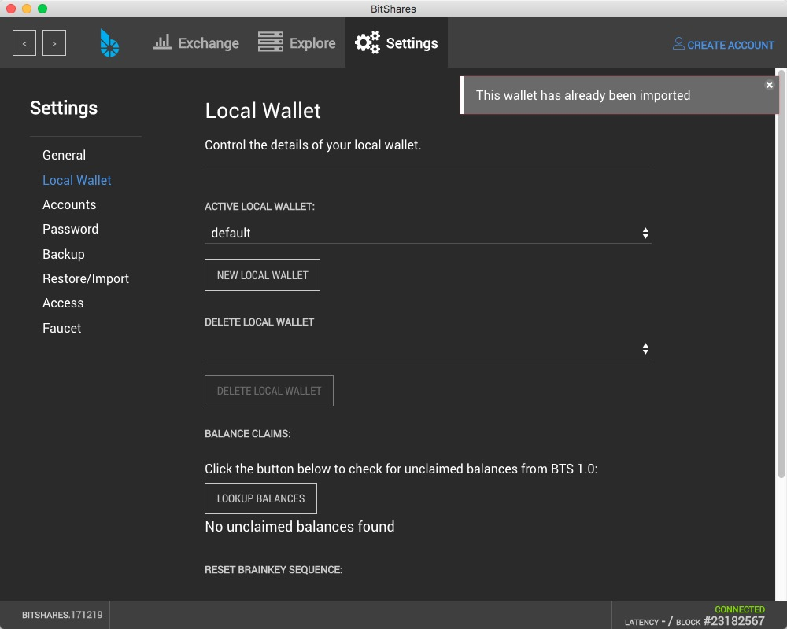
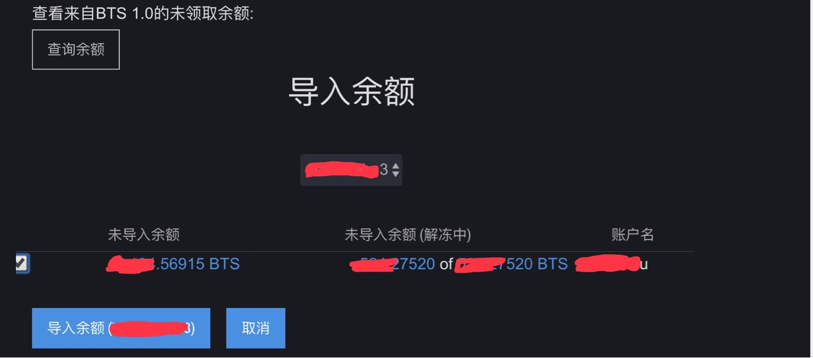

Date: 2018-01-03
Title:  pts导入bts2.0教程
Tags:  bts
Toc:no
Status: public
Position: 1

随着bts价格一路走高,很多人都开始研究起bts了.当年bts通过pts众筹的时候,估计很多人都挖过pts,然后可以看到很多人在pts导入bts2.0的时候都失败了.我也是其中之一,经过N天的尝试-放弃-尝试,终于成功了.把一些经验和关键点分享一下.  

首先感谢HIPDA论坛的lcjin哥们.在我放弃的时候,指点了我半天.最重要的是叫我不要放弃,让我给开发团队写信,给了我信心.坚持找了半天资料,最终成功,功夫不负啊!  

基本的套路不多讲了,pts.dat备份文件导入到053版本bts钱包,然后在导入093c版本后导出json备份(注意用console),然后导入2.0版本的钱包.网上的教程  http://btsabc.org/download/%E5%8E%9F%E5%A7%8B%E8%82%A1%EF%BC%88PTS%E3%80%81AGS%EF%BC%89%E5%85%91%E6%8D%A2BTS%E3%80%81PLS%E3%80%81MUSE%20%E6%95%99%E7%A8%8B.pdf(PTS、AGS 兑换BTS、PLS、MUSE - 比特股中文网) 写的还是很清楚的.  

最关键的问题,在于导入2.0后如何声明的问题.按照教程,把093c的json导入到2.0版本bts钱包,然后在钱包里查询来自1.0的余额,显示没有未领取.各种尝试都不行.


后来读到一篇帖子,核心问题讲的很明白了,地址如下
```
https://bitsharestalk.org/index.php/topic,24124.msg305890.html#msg305890
```
抄录一下解决的核心思路
```
Sorry for late reply. I am not great at elaborating stuffs. 

When FLuxer helped me, I learned a few things that i have not tried before.  1st, you need to make a wallet account. 2nd, make a backup after importing the keys to your wallet account (make sure to add "dot" BIN on the file name.) I will be making a video and will post it here. 

If, however, you only have a wallet.dat file, you will need to
1. install BitShares 0.9.3
2. create an account in the BitShares 0.9.3 wallet 
3. import the wallet.dat file into your account (Import your Bitcoin wallet.dat)
     https://drive.google.com/open?id=0B7288nKEgxRJRXdNX0lmeTljQTg

4. Then Export your keys: 
     Export via the console
navigate to the console: Account List -> Advanced Settings -> Console
type: wallet_export_keys [full path to the file]/[file name].json e.g. on Windows: wallet_export_keys C:\Users\[your user name]\Desktop\keys.json e.g. on Mac: wallet_export_keys /Users/[your user name]/Desktop/keys.json e.g. on Linux: wallet_export_keys /home/[your user name]/Desktop/keys.json
Please replace [your user name] with your Windows account name.
and hit Enter 
     http://docs.bitshares.eu/_images/export-wallet-console.png

5. Now Proceed to Bitshares 2.0. Create a wallet account model. 

6. Go to settings and Restore/Import: https://drive.google.com/open?id=0B7288nKEgxRJNVBhUzUyUTFETDg

7. Go to Wallet and Click Lookup Balance: https://drive.google.com/open?id=0B7288nKEgxRJU0ZETHZXc20xeTg

8. Create Backup (Make sure you add .BIN when saving the file): https://drive.google.com/open?id=0B7288nKEgxRJTWpiOVRSb3NjeDg
     See the difference: https://drive.google.com/open?id=0B7288nKEgxRJMTVqd3V6NmRnREU

9.  You may need to make a new account or change your wallet profile, but the next step is to go to restore/import and import the BIN file. 
https://drive.google.com/open?id=0B7288nKEgxRJMkd4QUNVb05IODg

10 Repeat Step 7. you should be able to see your keys. Then Claim it. 

11. Donate to luther-10 if you find this helpful. If you want me to make a video, someone should lend  me their unclaim private keys and i will make it into video to help everyone.  
```

总结一下2.0操作套路
```
新建本地钱包,导入093c的备份,此时没有unclaimed blances
备份本地钱包(bin格式)
新建一个新的本地钱包账户
在新建的钱包里面导入老的bin备份
此时lookup for unclaimed blance就应该有了
```


```
我是用web的在线钱包操作成功的
https://bitshares.openledger.info/
```


so,good luck everyone

有疑问的可以email: xiaotianhu@qq.com


