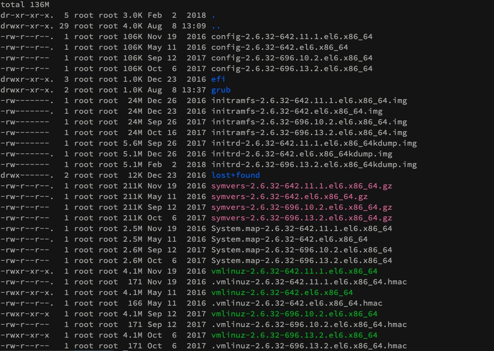

Title: kvm/virsh 异常断电导致虚拟机无法启动的修复实战

关键词:
mount qcow2 on linux  
xfs_repair  xfs磁盘修复  
kvm virsh console  
kvm虚拟机无法启动 故障排查 


公司异常断电,导致2台kvm的虚拟机无法启动了.
尝试修复的过程记录一下.

首先看报错,log一般都在/var/log/libvirt/qemu下面.
发现log很简单,没什么内容,也没有异常.谷歌一番发现可以打开debug的错误:
>修改/etc/libvirt/libvirtd.conf  
>将日志级别设置为 1（调试）  
>log_level = 1  
>指定日志输出文件名称  
>log_outputs="1:file:/var/log/libvirt/libvirtd.log"  
>重启libvirtd (systemctl restart libvirtd)  

结果打出一堆虚拟机的debug log,并不是我想要的,没什么用.  
猜想是磁盘问题,但是console连接不了,virsh console vm1 之后没有反应.  
思路上,还是得能看到虚拟机的输出才好知道怎么办.于是尝试VNC连接,  
结果对着教程弄了半天,mac的VNC客户端还是连不上,一闪就断了.只能放弃了  

此时没信心了,寻思得重装了吧.先把文件恢复了.  
谷歌一下(mount qcow2 on linux),找到一篇很棒的教程:http://ask.xmodulo.com/mount-qcow2-disk-image-linux.html  

我们的虚拟机用的qcow2的格式,有一台是ext4有一台是xfs的文件系统.  
推荐用guestmount的方式,nbd方式还得编译内核才能挂载nbd模块,我这台宿主机centos7就没有nbd模块.后来我编译了一下挂载了,感觉也没什么大优势还挺麻烦.  

```
yum install libguestfs-tools
```

装好之后 guestmount -a /path/to/qcow2/image -m <device> /path/to/mount/point  
就可以把image里面的文件系统挂载到指定目录去,就可以看到文件了.  
eg:  
```
guestmount -a /var/lib/libvirt/images/xenserver.qcow2 -m /dev/sda1 /mnt
```

这个device,/dev/sda1可以随便打,然后会提示你正确的有哪几个.还挺方便的.  
能看到文件了,重装至少心里有底了.还是不满足,想看到虚拟机到底什么情况.着手研究console  

找到的教程(https://blog.csdn.net/lemontree1945/article/details/80461037 还有https://www.oldboyedu.com/zuixin_wenzhang/index/id/366.html) 都是得进入系统才行的.但是现在进不去系统,而且我见过console是可以显示进去系统前的启动log的,所以肯定不是系统打开的TTY Console.那么猜测就是Grub的问题了.    

谷歌,关键词(kvm grub console),基本上学习了一圈之后总结如下:
前提:文件系统能通过guestmount成功mount,主要mount的boot分区(不是root),这个分区一般存的都是引导文件和grub的配置文件.在能正常启动的机器上,就是对应的/boot 目录.文件内容如下  
  

对应的关系  

  

在用guestmount 的时候提示你挂载哪个磁盘的时候都写的很清楚,挂载boot这个就ok了.这个盘一般也不会坏,都能挂成功.  

### 对于Centos6
我司centos6用的是grub(没有2).挂载好后,修改 grub/grub.conf 文件
```
title CentOS (2.6.32-696.13.2.el6.x86_64)
	root (hd0,0)
	kernel /vmlinuz-2.6.32-696.13.2.el6.x86_64 ro root=/dev/mapper/vg_2cloo-lv_root rd_NO_LUKS LANG=en_US.UTF-8 rd_LVM_LV=vg_2cloo/lv_swap rd_NO_MD SYSFONT=latarcyrheb-sun16 crashkernel=auto rd_LVM_LV=vg_2cloo/lv_root  KEYBOARDTYPE=pc KEYTABLE=us rd_NO_DM rhgb quiet console=ttyS0
	initrd /initramfs-2.6.32-696.13.2.el6.x86_64.img
```

这个每一项对应的是我们开机时候在屏幕上能够看到的启动项.在kernel一行 quiet参数后面加 console=ttyS0 
即可.

### 对于centos 7
centos7使用的是Grub2,推测跟grub类似应该.打开grub2/grub.cfg,发现文件内容完全不一样了,是shell形式的了
稍微看了一下,形式差不多 也是定义了每个启动项,找到  

``` 
linux16 /vmlinuz-3.10.0-514.2.2.el7.x86_64 root=/dev/mapper/centos-root ro ipv6.disable=1 crashkernel=auto rd.lvm.lv=centos/root rd.lvm.lv=centos/swap rhgb quiet console=ttyS0
```  

在quiet后添加console=ttyS0好了  

现在启动后,virsh console vm1 能成功进入console了,基本上成功一大半了.  
然后dmesg看一下启动log,发现xfs挂载有问题,进入了centos emergency mode紧急模式.  
对于xfs系统来说:  
/sbin/xfs_repair /dev/mapper/centos-root看一下,一般会提示有错误.  
然后加-L 参数修复错误.修复之前最好备份一下虚拟机, virsh destroy vm1然后把img文件复制一个出来好了.  

执行/sbin/xfs_repair -L /dev/mapper/centos-root,有很多不一致的情况都修复好了.然后reboot 系统就起来了,美滋滋.  
对于ext4格式的系统,可以  
```
umount /
fsck.ext4 -y /dev/sda1
```
尝试修复就ok了  
