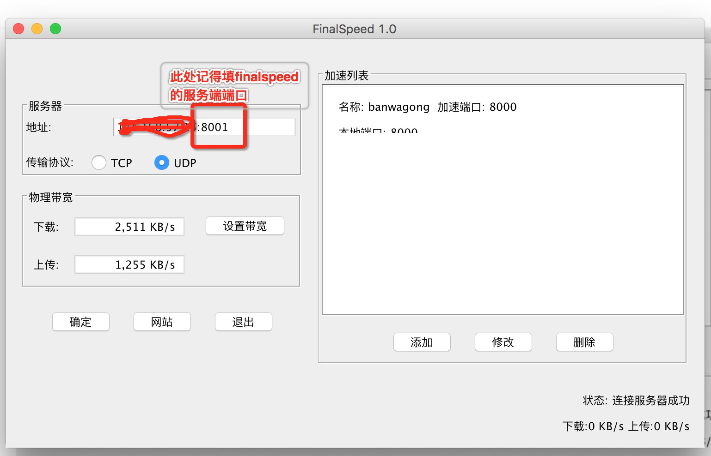

Date: 2016-03-12
Title: mac+搬瓦工部署finalspeed&常见失败解决方法&群晖局域网部署
Tags:  mac 搬瓦工 finalspeed 
Toc:no
Status: public
Position: 1

这几天有需求看看Youtube,然而搬瓦工的速度并不给力,ss的速度只有100k左右,只能看个迷迷糊糊的240p,根本无法发挥youtube的优点.之前搞过速锐也没什么卵用,听闻最近出的finalspeed是神器,准备搞一下.

mac部署的教程就不写了,装上java,下载好finalspeed的客户端就成了.可以参考这个 里面有下载:
```
http://www.jianshu.com/p/c41ed5f9f6f1
```

然后部署搬瓦工.搬瓦工已经部署了ssserver了,finalspeed按照教程一键安装.我修改了finalspeed的服务端端口为8001
```
mkdir -p /fs/cnf/ ; echo 8001 > /fs/cnf/listen_port ; sh /fs/restart.sh 
```

由于是openvz架构,只支持udp.  cat /fs/server.log 日志如下:
```
FinalSpeed server starting...
System Name: linux
Listen udp port: 8001
Listen tcp port: 8001
Network Interface List:
     venet0
  Pseudo-device that captures on all interfaces   any
     lo
Select Network Interface failed,can't use TCP protocal!

FinalSpeed server start success.
```
说明启动成功,已经在8001端口监听UDP了.

```
 注意: 服务端的Shadowsocks需要Listen 0.0.0.0 ,否则finalspeed连接失败 
 iptables如果阻止了8001也需要放开
```

再来看MAC的设置,finalspeed如下

```
注意:需要带上服务器端的8001端口,否则连接失败
```
搞定之后,shadowsocksX客户端,按照教程添加一下 127.0.0.1,端口8000(finalspeed里面设置的)就OK了

打开个Youtube视频感受一下吧.

```
更新 有群晖的可以部署在群晖上,这样局域网用就很爽了 
还没测试安卓客户端,理论应该可行
```

找了一个命令行下的finalspeed客户端,群晖装好java 启动成功
https://github.com/zqhong/finalspeed/releases 命令行客户端 

群晖装java很简单  装好之后命令行进去,命令:
nohup /var/packages/JavaManager/target/Java/bin/java -jar client.jar &

配置自己照着mac上的改一下 或者直接复制过去就行了
ss的127.0.0.1改成局域网群晖的ip,完美
