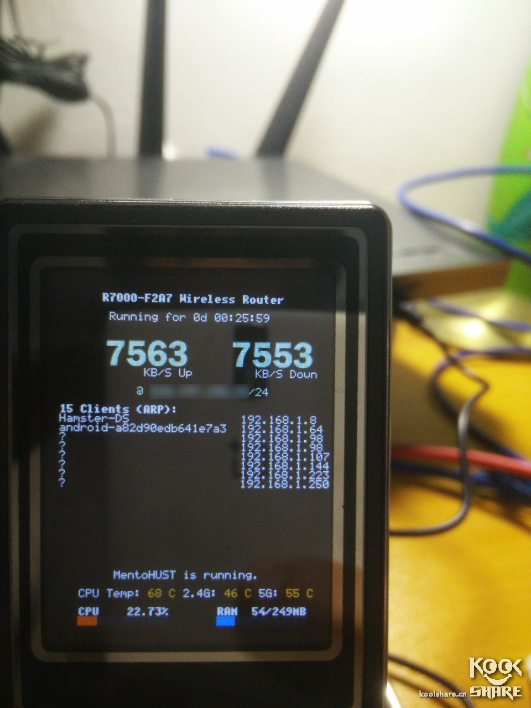

Date: 2016-12-17
Title: 梅林固件/R6300V2 安装Lcd4Linux显示屏
Tags:  梅林 R6300 lcd4linux 显示屏
Toc:no
Status: public
Position: 1

  下定决心,给R6300V2刷了梅林.过去局域网5G文件写入最快能到30M,现在读写都能过60M了,还是梅林牛逼啊!想起来可以挂载小屏幕,论坛搜了一下,很简单.记录一下 怕以后资源没了.

  帖子地址:http://koolshare.cn/forum.php?mod=viewthread&tid=43420&highlight=lcd4linux 

  效果很棒,如图 
把下载的附件解压上传到路由.
文件: 
```
1. 路由开启ssh
2.WinSCP  拷贝LZ附件里面的3个文件夹到jffs。
3.webshell 运行 chmod a+rx /jffs/bin/* 
4.重启路由 webshell 运行 /jffs/bin/start_lcd.sh
```
如果有问题的话,可以加上 -vv 参数看看报错信息.
自动启动应该是把start_lcd.sh拷贝到 /jffs/scripts目录中,记得加执行权限.然后要开启路由的JFSS脚本功能,系统管理->系统设置->Enable JFFS custom scripts and configs 重启 

ENJOY!
