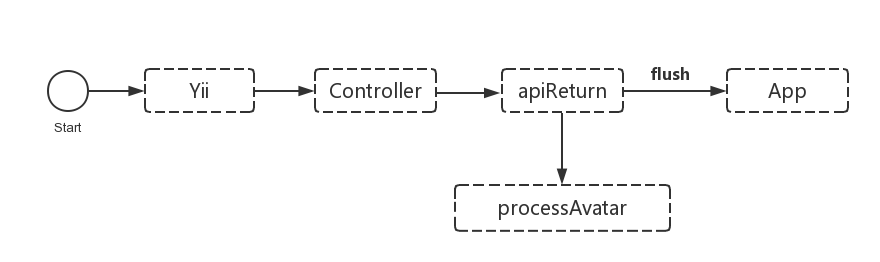
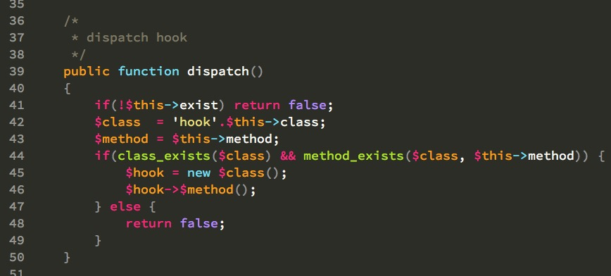

Date: 2015-10-15
Title: (伪)异步实现加速PHP接口的返回速度
Tags:  PHP
Toc:no
Status: public
Position: 1

App的服务端采用PHP开发,接口返回通常都是使用echo输出json来与App通讯.最近遇到一个问题:

App通过微信登录后,需要回调服务器保存相关数据,等待服务器返回后才显示登录成功.服务器需要处理用户相关的信息,把微信返回的头像地址保存到本地图片使用.这个图片是微信的一个url,在获取的时候速度比较慢,经常超过5秒,导致微信登录非常之卡.

为了解决这个问题,首先想到,把这个保存头像的方法单独拿出来,异步来处理.但是PHP天生缺陷,异步只能依靠队列等其他方法,比较麻烦.

其次,又想起echo是可以flush的,鸟哥的blog中也有提到,于是打算走这条路.整个项目封装了一个apiReturn方法来返回数据,大致流程如下:

然而事情并没有按照计划来发展,flush没有生效.四处谷歌,发现如下:  

> So that’s what I found out: Flush would not work under Apache’s mod_gzip or Nginx’s gzip because, logically, it is gzipping the content, and to do that it must buffer content to gzip it. Any sort of web server gzipping would affect this. In short, at the server side, we need to disable gzip and decrease the fastcgi buffer size. [http://stackoverflow.com/questions/4706525/php-flush-not-working](http://stackoverflow.com/questions/4706525/php-flush-not-working)

这个方法没戏了,Server都是走Nginx+PHP-FPM架构,因为这个把gzip和buffer关掉得不偿失.继续搜,发现有提到fastcgi_finish_request方法的,文档:[http://php.net/manual/zh/function.fastcgi-finish-request.php](http://php.net/manual/zh/function.fastcgi-finish-request.php)

> 此函数冲刷(flush)所有响应的数据给客户端并结束请求。 这使得客户端结束连接后，需要大量时间运行的任务能够继续运行。

这不就是我要的么.拿他代替flush,果然ok.自己封装了一个hook,可以在apiReturn后,根据requestUri自动寻找对应的hook和方法执行,用$_POST或者$GLOBALS来传递数据就ok,如此解决 登录再也不卡了.

