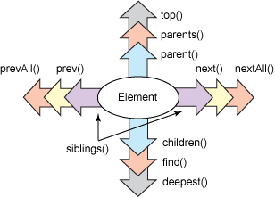
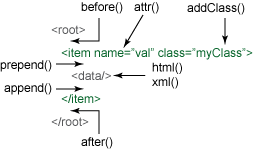

QueryPath PHP的Jquery实现

    HTML,HTTP和XML,是WEB技术领域无可争议的三大基础支柱技术.然而对于PHP开发者来说,在使用这三种技术的时候可能会比较麻烦.新出现的QueryPath库,是一个使用PHP实现的如同Jquery的类库,提供了方便强大的处理XML,HTTP,HTML的类库.无论是WEB网页,WEB service,SVG或者SPAARQL,RDF,Atom,QueryPath都能处理,并且用PHP语言提供了健壮并简单易用的API.在本文中,介绍了如何构建QueryPath对象,如何遍历并处理XML和HTML.

###QueryPath###

    从使用简单方面,QueryPath的语法很简洁,方法的名字都很短并且语义化,很容易知道是做什么的(比如text(),append(),remove()).因为很多方法返回的都是QueryPath对象,方法的调用是支持链式调用的.这种用法有时候也叫做流式接口.为了符合Javascript开发者的习惯,QueryPath实现了Jquery主要的遍历方法和操作方法.

    从健壮性来说,QueryPath提供了载入,读取,搜索,写入XML与HTML的工具.尽管不考虑类库的大小,通用的接口还是很难满足所有的需求,QueryPath提供了扩展开发接口,可以给QueryPath添加新的方法.同时其扩展也包含了数据库支持,模板支持,以及额外的XML支持.

    或许你也会说,为啥还需要一个XML或HTML的轮子?PHPv5已经提供了很实用的XML工具,也有DOM实现和SimpleXML类库了.答案很简单:QueryPath被设计作为一个通用的工具.DOM API复杂并且笨重.虽然它的对象模型可能很强大,但是即便实现最简单的功能都需要写很多行代码.SimpleXML,对于许多需求来说又太过简陋了.除非XML是完全确定的,使用SimpleXML来操作文档才比较简单.
    QueryPath正是力求在DOM的功能性与SimpleXML的简单之间找到一个平衡点.

###需求:###

    QueryPath是纯PHP的类库,所以可以直接从官方网站下载后使用

    QueryPath的系统要求很少,只要PHPv5版本并且开启DOM扩展就可以.大部分的PHPv5发行版都符合开箱即用的需求.QueryPath不支持遗弃多年的PHPv4.

###链式调用:###

    QueryPaht有四个基本的概念:

    * 一个QueryPath对象总是会与一个XML或HTML文档关联
    * QueryPath可以查询文档,并生成一个匹配的结果集
    * QueryPath可以操作文档,可以对文档进行新增,修改,删除操作.
    * QueryPath的方法支持链式调用,所以一行语句可以执行多个方法.只需几行代码就可以对文档进行载入和增删改查等操作

    上代码,包含如上的特点:

```
    <?php
    require 'QueryPath/QueryPath.php';

    qp('sample.html')->find('title')->text('Hello World')->writeHTML();
    ?>
```

    例子中只包含了一个文件,QueryPath/QueryPath.php ,这就是使用QueryPath需要包含的唯一的文件,除非还用到了QueryPath的其他扩展.

    下面一行代码就是QueryPath的链式调用,其做了如下事情:

    * 新建一个QueryPath对象,并指向sample.html文档.当qp()方法执行的时候,就会创建一个新的QueryPath对象,用于之后对其进行载入和解析.
    * 通过find()方法对文档进行搜索,使用CSS3选择器寻找所有<title></title>元素 
    * title的text值设置为了Hello World,当执行到此,title的子节点都会被替换成CDATA字符串Hello World.所有的内容都会被销毁.
    * 所有文档都会通过writeHTML()方法写入到标准输出.

    上面的例子还可以简化,qp()方法支持把CSS选择器作为可选的第二个参数传入.下面是简化后的版本:

```
    <?php
    require 'QueryPath/QueryPath.php';

    qp('sample.html', 'title')->text('Hello World')->writeHTML();
    ?>

```
    假设sample.html是空白的HTML文档,上面的例子输出会跟下面的内容差不多:

```
    <!DOCTYPE html PUBLIC "-//W3C//DTD HTML 4.01//EN" "http://www.w3.org/TR/html4/strict.dtd">
    <html lang="en">
    <head>
        <title>Hello World</title>
    </head>
    <body>
    </body>
    </html>
```

>   这些简单的例子展示了QueryPath可以实现的功能.下面介绍一些其他的方法:

    
###qp()工厂方法:###

     在QueryPath中最常用的基础方法就是qp()方法.这个方法会生成一个新的QueryPath对象,就像传统的constructor构造方法做的事情一样.

     如果你对面向对象的开发模式比较熟悉,你可能会发现qp()方法实现了工厂模式.QueryPath采用了一个方法,而不是通过定义工厂类的构造方法来实现工厂模式.这样干能节省一些代码量,更重要的是这种实现使得QueryPath更接近jQuery,如果你对jQuery比较熟悉,学习难度曲线会降低一些吧.

     一个QueryPath对象必须与一个XML或者HTML文档关联,一旦对象创建好,他们就会绑定在一起.qp()方法支持三个参数,都是可选的:

```
    #文档#  可以是文件名,URL,XML或者HTML字符串,DOM文档或者DOM元素,SimpleXML元素,或者一个DOM元素数组.如果不是这些支持的类型,则会创建一个空的XML文档.

    #CSS3选择器#  如果传了这个参数,载入文档的时候QueryPath会同时使用这个选择器查询文档

    #选项数组#  可以针对这个QueryPath实例,传一组配置参数进行配置.API文档有此处支持的参数的详细说明
```

     qp()方法的第一个参数支持数量众多的类型的文档,从而可以很简单的创建一个QueryPath对象.QueryPath可以通过文件名或URL来载入文档.如果传的是XML/HTML字符串,也可以直接解析内容.同时,也支持DOM和SimpleXML这两种常见的XML文档.下面的例子展示了直接传XML字符串的用法:

```
    <?php
    require 'QueryPath/QueryPath.php';

    $xml = '<?xml version="1.0"?><doc><item/></doc>';
    $qp  = qp($xml);
    ?>
```

    执行上面的代码,$qp会指向一个经过解析XML的QueryPath对象.如果PHP的配置中允许HTTP/HTTPS流式封装,(大部分PHPv5发行版都支持),则也可以通过HTTP URL来载入内容.

```
    <?php
    require 'QueryPath/QueryPath.php';

    $qp = qp('http://example.com/file.xml');
    ?>
```

    因此,QueryPath也可以用来解析Web Services.创建新文档的时候,有一种方便的载入HTML样板的方式:
    
```
    <?php
    require 'QueryPath/QueryPath.php';

    $qp = qp(QueryPath::HTML_STUB);
    ?>
```

     QueryPath::HTML_STUB包含了一个最基本的HTML样板,内容如下:

``` 
    <?xml version="1.0"?>
    <!DOCTYPE html PUBLIC "-//W3C//DTD XHTML 1.0 Strict//EN"
      "http://www.w3.org/TR/xhtml1/DTD/xhtml1-strict.dtd">
    <html xmlns="http://www.w3.org/1999/xhtml">
    <head>
        <meta http-equiv="Content-Type" content="text/html; charset=utf-8"/>
        <title>Untitled</title>
    </head>
    <body></body>
    </html>
```

    通过样板文件,可以更快捷的创建一个新的HTML文档.

###遍历文档###

    打开一个文档之后,会需要对文档进行遍历来找到需要的内容.QueryPath在这方面的设计非常易用.为了满足大部分遍历的需求,QueryPath提供了多种方法,大部分都支持使用CSS3选择器来找到对应的节点.

    

    上图总结了最常用的遍历方法.下面有具体对应的描述.除此之外还有别的方法,这些介绍的是最常用的方法.

>find() 
    在当前的节点内选择符合selector的元素(支持CSS选择器)

>xpath()
    选择符合Xpath表达式的节点(不支持CSS选择器)

>top()
    选择文档的根节点元素(不支持CSS选择器)

>parents()
    选择任意多个父节点(支持CSS选择器)

>parent()
    选择一个父节点(支持CSS选择器)

>siblings()
    选择所有兄弟节点,前后都包括(支持CSS选择器)

>next()
    选择下一个兄弟节点(支持CSS选择器)

>nextAll()
    选择当前节点之后的所有兄弟节点(支持CSS选择器)

>prev()
    选择上一个兄弟节点(支持CSS选择器)

>prevAll()
    选择所有前面的兄弟节点(支持CSS选择器)

>children()
    选择该节点的子节点(支持CSS选择器)

>deepest()
    选择该节点最深的子节点或该节点下的所有子节点(不支持CSS选择器)

    QueryPath的许多方法都可以精确的查询到指定的元素,上面列出来的大部分方法都支持CSS3选择器参数.只有top()和deepest()方法是不带参数的查询方法.

    来看一个简单的关于遍历的例子.假设有如下的XML文档:

```
    <?xml version="1.0"?>
    <root>
      <child id="one"/>
      <child id="two"/>
      <child id="three"/>
      <ignore/>
    </root>
```
    <root/>元素有四个子元素,有三个名为<child/>的元素,还有一个<ignore/>.可以通过QueryPath方法来选择<root/>的全部子元素

```
    <?php 
    require 'QueryPath/QueryPath.php';

    $xml = '<?xml version="1.0"?>
    <root>
      <child id="one"/>
      <child id="two"/>
      <child id="three"/>
      <ignore/>
    </root>';

    $qp = qp($xml, 'root')->children();
    print $qp->size();
    ?>
```
    children()方法会选择<root/>下的所有子元素,最后一行代码,打印了全部符合条件的元素,所以是4

    如果只想选定前三个<child/>元素而忽略<ignore/>元素,代码如下

```
    <?php 
    require 'QueryPath/QueryPath.php';

    $xml = '<?xml version="1.0"?>
    <root>
    <child id="one"/>
    <child id="two"/>
    <child id="three"/>
    <ignore/>
    </root>';

    $qp = qp($xml, 'root')->children('child');

    print $qp->size();
    ?>
```
    最后一行打印了符合条件的全部元素,共有3个.在QueryPath内部会保存这三个元素作为当前的上下文数据.如果想做进一步的查询,则会从这三个元素开始,如果插入数据 也会插入到这三个元素内.

#CSS选择器#

    CSS选择器是CSS表达式的一部分,用来确定样式会作用在哪些元素上.CSS选择器也可以在文档外部作为样式表的一部分来使用.QueryPath使用选择器作为查询的描述语言,并且支持在CSS3选择器标准中定义的特性和方法.

    CSS选择器在QueryPath中相当重要,上面介绍了十个支持CSS选择器作为参数的方法,虽然到目前我们用过的还只是简单的tag名字查询的方法,然而CSS3选择器远比这些列举的简单例子要强大的多.更详细的描述本文不做过多介绍,只列举一些常用的例子如下

```
    选择器:p 
    描述  :找到所有标签为<p/>的元素 
    匹配  : <p/> 
```

```
    选择器:.container 
    描述  :找到所有class属性为container 的元素 
    匹配  :<div class="container">
```

```
    选择器:#menu 
    描述  :找到所有id属性为menu的元素.
    匹配  :<div id="menu">
```

```
    选择器:[type="inline"]
    描述  :所有type属性为inline的元素
    匹配  :<code type="inline"/>
```

```
    选择器:tr > th 
    描述  :选择所有父元素为tr的th元素
    匹配  :<tr><th/></tr> 
```

```
    选择器:table td 
    描述  :选择祖先(如父元素或祖父元素)为table的所有td元素
    匹配  :<table><tr><td/></tr></table>
```

```
    选择器: li:first
    描述  : 选择第一个<li>元素.除了:first 还支持:last  :even  :odd
    匹配  : <li/>
``` 

    这些常见的选择器可以组合起来使用,从而组成复杂的查询.比如

> div.content ul>li:first

    这个语句会选择全部class为content的div,在div内部搜索全部的<ul>,返回每个<ul>内部的第一个<li>元素.

#在返回结果中遍历#

    上面已经介绍了两种遍历文档的方法,QueryPath内置方法和CSS3选择器.下面介绍一下如何遍历查询结果.

    一个QueryPath对象是可以遍历的,在PHP里面来讲,是可以作为迭代器遍历的.传统的PHP循环结构就可以对QueryPath的匹配结果对象进行遍历.

    如果想要独立的处理每个元素,也很容易.下面的例子,展示了QueryPath作为迭代器的用法.

```
    <?php 
        require 'QueryPath/QueryPath.php';

        $xml = '<?xml version="1.0"?>
        <root>
        <child id="one"/>
        <child id="two"/>
        <child id="three"/>
        <ignore/>
        </root>';

        $qp = qp($xml, 'root')->children('child');

        foreach ($qp as $child) {
          print $child->attr('id') . PHP_EOL;
        }
    ?>
```
    foreach循环的每个结果会赋值给$child变量,但$child变量不只是一个元素,它是一个指向当前元素的QueryPath对象,所以可以对其使用QueryPath提供的那些方法.
    为了与Jquery的Api保持一致,QueryPath也提供了一些读取和修改的方法.单个的方法,可以根据传递参数的不同,既能获取数据也可以修改数据.比如 attr()方法,qp()->attr("name")会获取name属性的值,qp()->attr("name","value")则会把name属性的值设置为value.其他一些方法,诸如text(),html(),xml(),都可以这样既能读取又能修改属性的值.

    由于所有的循环结果都包装在QUeryPath对象里,所以这些$child都可以调用QueryPath的方法,比如上面的attr(),来读取或者修改元素属性.

    上面介绍了使用QueryPath方法,CSS3选择器,迭代器来遍历文档,下面介绍一下如何用QueryPath修改文档.

#修改文档#

    遍历文档之后,接下来就可以对文档进行增删改查的操作了.再来看一下上面的例子.

```
    <?php
    require 'QueryPath/QueryPath.php';

    qp('sample.html')->find('title')->text('Hello World')->writeHTML();
    ?>
```

    在这个例子中,使用了text()方法来修改了<title/>元素的内容.QueryPath提供了一堆这样的方法来修改文档. 下图展示了这些方法作用的地方,这些方法都可以用来新增或是修改数据.绿色的标签表示当前选中的元素:

    
    
    这些方法都是用来处理字符串的,通常用在HTML或者XML文档中,用来往文档中插入数据.插入后的数据立刻就可以访问和操作.

    实际上,有两种类型的方法,其中一种可以操作XML片段,如下:

```
    append():  在当前选中的元素中插入数据作为最后一个子元素 
    prepend(): 在当前选中的元素中插入一个元素并作为第一个子元素
    after():   在当前选中的元素后插入新的元素 
    before():  在当前选中的元素前插入新的元素
    html():    用一段HTML代码替换当前元素的子元素
    xml():     用一段XML代码替换当前元素的子元素
```

    上面列举的方法,参数都需要传格式化好的XML或者HTML数据.下面展示一个html()方法的例子:

```
    <?php
    require 'QueryPath/QueryPath.php';

    qp($file)->find('div.content')->html('<ul><li>One</li></ul>');
    ?>
```
    上面图片列举的操作方法没有包括remove()方法,这玩意实在是没法画出来.这个方法是从文档中删除元素用的,如果调用的时候不传参数,则会把当前选中的元素干掉.但是,就像其他QueryPath的方法一样,remove()也可以传CSS3选择器参数,然后把所有符合条件的元素删掉.

    另一类方法,是用来操作元素属性的,只有两个:

```
    attr():      获取/设置所有选中元素的属性
    addClass():  为当前选中的所有元素添加一个类
```
    
    也有其他一些跟属性相关的方法,比如removeClass(),可以传一个类名,然后会把元素中相关的类删掉.removeAttr()方法,可以传一个属性名作为参数,然后把当前所有选中元素的属性删掉.

    如此这般,把这些基本的工具组合在一起,就能实现强大的功能了.下面的例子是基于Twitter的,就不翻译啦.

    原文地址:http://www.ibm.com/developerworks/library/os-php-querypath/


