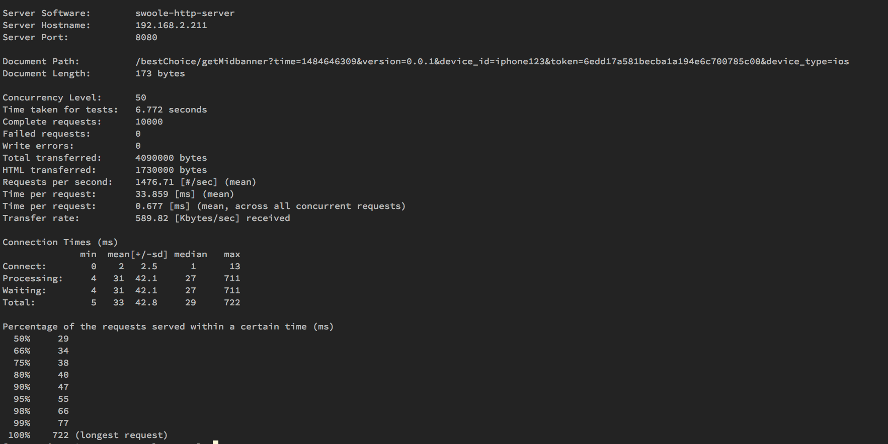
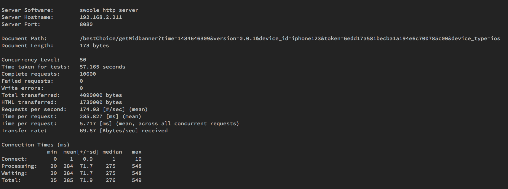
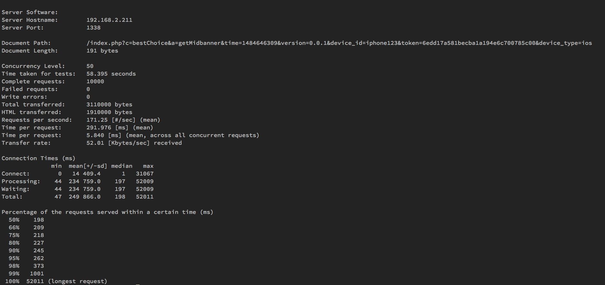

Date: 2017-02-10
Title: reactPHP + lumen性能简测
Tags:  react PHP lumen
Toc:no
Status: public
Position: 1

工作需要,新项目用Lumen框架来做.因为后端API,用Laravel感觉更大了,用Lumen还能轻量一点.接口写的差不多了,就研究捣鼓一下性能.Lumen本身的性能还是很捉鸡,不光Composer载入一大坨依赖,自己的框架就很复杂,虽然容器的思路真的很棒,对于工程而言是非常好的设计,但是性能比简单框架还是差一些的.

开始想着上Swoole,有第三方的lumen-swoole的包:
```
composer require encore/lumen-swoole 5.3.x-dev
```
但是我swoole版本太高了,懒得重新编译swoole了,把这个项目直接clone到lumen项目的packages文件夹(自己建一个),然后修改composer.json
```
"repositories": [
    {
        "type": "path",
        "url": "packages/lumen-swoole"
    }
]

手动修改一下lumen-swoole的swoole依赖版本号,然后 
composer require "encore/lumen-swoole:*@dev"

然后就可以用本地修改过的lumen-swoole 来安装了.
```
运行会报错,发现目录是ln过去的,有点问题  
直接把 packages/lumen-swoole 拷贝到vendor/encore/lumen-swoole下  
运行:  
./vendor/encore/lumen-swoole/bin/lumen-swoole -s /home/luo/git/lumen_api/bootstrap/app.php --worker_num 50  
就启动成功了~

总觉得swoole这种扩展的方式略麻烦,给运维和部署都带来一点麻烦.想起来之前看过的ReactPHP,寻寻觅觅找到了PHP-PM这个项目:
```
https://github.com/php-pm/php-pm 
```
这个就是给ReactPHP做了个多进程的管理器,跟PHP-FPM的感觉差不多.然而这货支持Laravel却不能用Lumen5.2,真是坑爹.折腾了一天多那个HttpKernel也没能给Lumen跑起来,各种问题;转而一想直接用ReactPHP试试吧,正好后续我还需要用websocket做点事儿;
```
https://github.com/reactphp/react 
```
这货的介绍很简单:Nuclear Reactor written in PHP. http://reactphp.org

本质上就是拿PHP写的一个异步非阻塞框架,如果有Libevent扩展就会用Libevent相关函数来做,没有的话他们拿PHP写了个事件循环,用stream_select来调度事件,性能会比用libevent/libev差一些了,不过Lumen的性能瓶颈并不在此;主要还是频繁初始化框架消耗的资源太多;

安装比较简单:
```
composer require react/react 
```
在lumen/public下新建个server.php作为启动服务器的入口,代码如下

```
<code>
<?php
require '../vendor/autoload.php';

function processUri($query) {
	if(empty($query['c']) || empty($query['a'])) return false;
	foreach($query as $key=>$val) {
		if($key != 'a' && $key != 'c') $_GET[$key] = $val;
	}
	return "/{$query['c']}/{$query['a']}";
}

$lumenApp = require __DIR__.'/../bootstrap/app.php';
$app = function ($request, $response) use ($lumenApp){
	$_SERVER["ENV_STATUS"]     = 'dev';
	$_SERVER["REQUEST_URI"]    = processUri($request->getQuery());
	if(empty($_SERVER["REQUEST_URI"])) return false;
	$_SERVER["REQUEST_METHOD"] = $request->getMethod();
	$lumenApp->instance('StreamResponse', $response);
	$lumenApp->run();
};


$loop        = React\EventLoop\Factory::create();
$socket      = new React\Socket\Server($loop);
$http        = new React\Http\Server($socket);

$http->on('request', $app);

$socket->listen(1338, "0.0.0.0");
$loop->run();
</code>
```
为了跑起来简单一写,没有优化;因为没有nginx所以rewrite也没有的,访问的时候需要用127.0.0.1:1338/index.php?c=controller&a=function&a=b这样的格式来访问;返回的话,可以写一个Middleware来拦截Response返回:
```
public function handle($request, Closure $next)
{
	$response = $next($request);
	if (!($response instanceof Response)) {
		$response = response($response);
	}
	$resContent = $response->getContent();
	//reactPHP response
	$r = app('StreamResponse');
	$r->writeHead(200, ['Content-Type' => 'application/json;charset=UTF-8']);
	$r->write($resContent);
	$r->end();
}
```
如果是接口有统一的返回方法也可以直接在返回方法中写;对于静态文件,可以参考这个库:
```
https://github.com/phly/react2psr7
```
我是直接拿来用了,没有按照示例的那么啰嗦:
``` 
Server.php

....

use React2Psr7\StaticFiles;
$staticFiles = new React2Psr7\StaticFiles(dirname(__DIR__)."/public");

$loop        = React\EventLoop\Factory::create();
$socket      = new React\Socket\Server($loop);
$http        = new React\Http\Server($socket);

$handler = function($request, $response) use ($lumenApp, $staticFiles){
    return $staticFiles($request, $response, $lumenApp);
};
$http->on('request', $handler);

....

``` 
捣鼓差不多了,直接php server.php启动,开始测试.上几个测试图吧


swoole 50个worker的效果,性能确实牛逼


swoole 1个worker,为了跟reactPHP对比



reactPHP的性能;可以看出来,单核心性能跟swoole不相上下,但是稳定性还是有点略差,有一定的timeout和崩溃等等情况的概率,所以后面有空捣鼓一下phppm,就跟swoole一样有进程管理机制,应该就好多了.BTW,变量就要记得释放,要不然泄露起来也真是麻烦啊,很难找嘞

这个接口,用NGINX+PHP-FPM 50个进程,RPS大概是60;没法比啊没法比...


