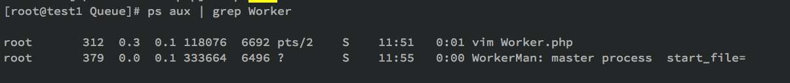
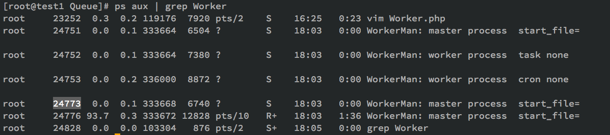
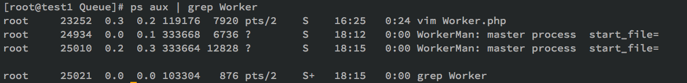

Date: 2015-11-23
Title: WorkerMan的restart命令的一个Bug修复记录
Tags:  PHP WorkerMan Bug
Toc:no
Status: public
Position: 1

最近一个项目更新之后总是出问题,守护进程总是自己会挂掉,日志显示重启失败,之前一直好好的.周末一个下午DEBUG,终于搞定了.记录一下.

```
前情提要:
    用PHP的WorkerMan写了一个Worker进程,监听Redis队列,另外的项目往队列里塞URL然后异步执行.很简单,一直运行稳定.但是以防万一,最近上线写了一个watcher,通过crontab每分钟监控这个队列往队列写入一个任务,如果执行超时,就调用WorkerMan的restart命令进行重启.
    除此之外还有一个Worker,监听数据库执行定时任务,原理类似.
    程序入口文件 StartWorker.php代码大致如下

    $task = new Worker();
    $task->onWorkerStart = function($task)
    {
        $dispatch = new dispatch();
        $dispatch->run();
    };
    $cronQueue = new Worker();
    $cronQueue->onWorkerStart = function($task)
    {
        $cronjob = new cron();
        $cronjob->run();
    };
    Worker::runAll();

    启动成功后,Workerman生成三个进程,一个master,两个Worker
```

通过Log判断,是watcher在对Workerman执行restart的时候出现了问题.Log中重复的都是
```
Workerman[./StartServer.php] restart
Workerman[./StartServer.php] is stoping ...
Workerman[./StartServer.php] stop fail
```
所以从WorkerMan执行restart看起吧.

watcher,调用restart命令:./StartServer.php restart -d 

从WorkerMan的执行流程看起:
```
public static function runAll()
    {
        // 初始化环境变量
        self::init();
        // 解析命令
        self::parseCommand();
        // 尝试以守护进程模式运行
        self::daemonize();
        // 初始化所有worker实例，主要是监听端口
        self::initWorkers();
        //  初始化所有信号处理函数
        self::installSignal();
        // 保存主进程pid
        self::saveMasterPid();
        // 创建子进程（worker进程）并运行
        self::forkWorkers();
        // 展示启动界面
        self::displayUI();
        // 尝试重定向标准输入输出
        self::resetStd();
        // 监控所有子进程（worker进程）
        self::monitorWorkers();
    }
```
parseCommand这一步,解析了命令中的restart命令.伪代码

```
parseCmd (){
    switch
    case: restart
    case: stop
        $master_pid = @file_get_contents(self::$pidFile);
        $master_pid && posix_kill($master_pid, SIGINT);//向正在运行的WorkerMan的Master发送SIGINT信号让其退出
        while(1) {  
            // 检查主进程是否存活
            $master_is_alive = $master_pid && posix_kill($master_pid, 0);
            if($master_is_alive){
                //等待5s 超时则说明master进程没有退出,continue 继续while循环
            }
        }
        
```
所以restart命令就是通过向正在运行的Master进程发送SIGINT让原来的Master和Worker全部退出,然后自己启动接替原来的工作.log中一直stop失败,通过ps aux | grep WorkerMan可以发现,原来的Master还在运行,但是Worker已经全部退出了.


继续研究,向Master进程发送SIGINT的时候执行了什么呢?

启动的时候,通过installSignal()定义了处理signal的方法
```
pcntl_signal(SIGINT,  array('\Workerman\Worker', 'signalHandler'), false);
```
发现SIGINT信号对应的处理方法是self::stopAll();


StopAll的伪代码如下:
```
self::$_status = self::STATUS_SHUTDOWN;
if(self::$_masterPid === posix_getpid())
{
    //如果是master 则向Worker发送SIGINT信号
    $worker_pid_array = self::getAllWorkerPids();
    foreach($worker_pid_array as $worker_pid)
    {
        posix_kill($worker_pid, SIGINT);
    }
} else {
    //如果是Worker 则执行stop方法进行清理并退出
    foreach(self::$_workers as $worker)
    {
        $worker->stop();
    }
    exit(0);
}

```

这一步应该是ok的,因为ps aux|grep Worker ,child已经没有了,只剩下master了.
此处并没有Master退出的相关代码,但是可以看到,做了status的标记,所以一定在其他地方实现了对status的监控.
搜索STATUS_SHUTDOWN,发现在879行,monitorWorkers()函数里.开始分析这个函数:


```
while(1)
{
    //此处会suspand阻塞,直到有Worker退出,并返回退出的Worker的pid
    $status = 0;
    $pid = pcntl_wait($status, WUNTRACED);
    if($pid > 0)
    {
        //pid>0说明退出的是子进程 需要判断当前的status状态决定是否需要启动新的Worker来补充退出的Worker  
        foreach(self::$_pidMap as $worker_id => $worker_pid_array)
        {
            if(isset($worker_pid_array[$pid]))
            { 
                //log
                // 清除退出的Worker信息
                unset(self::$_pidMap[$worker_id][$pid]);
            }
        }
        // 如果不是关闭状态，则补充新的进程
        if(self::$_status !== self::STATUS_SHUTDOWN) self::forkWorkers();
    } else {
        // 如果是关闭状态，并且所有进程退出完毕，则主进程退出
        if(!self::getAllWorkerPids()) self::exitAndClearAll();
    }
}
```
这个函数是启动后执行的最后一个函数,是master进程执行的.这个函数通过while(1)循环来保证master一直运行,通过
```
    $pid = pcntl_wait($status, WUNTRACED);
```
来同步子进程的退出状态.pcntl_wait函数会一直阻塞直到有子进程退出,然后会返回子进程的PID.
master检测到有子进程退出后记录子进程退出的status到日志中,然后重点来了
```
    // 如果不是关闭状态，则补充新的进程
    if(self::$_status !== self::STATUS_SHUTDOWN)
```
也就是,在此检查self::$_status变量,之前在stopAll方法中,已经设置了这个变量为self::STATUS_SHUTDOWN
如果status不是SHUTDOWN状态,则在此新建worker进程来替补掉退出的Worker进程.此处不管,我们要看的是退出部分
```
    // 如果是关闭状态，并且所有进程退出完毕，则主进程退出
    if(!self::getAllWorkerPids())
    {
        self::exitAndClearAll();
    }
```
在此打印了一下,果然有返回值,所以此处的self::exitAndClearAll();并没有执行,master也就没有退出.为啥有child退出了但是没有清除自己的pid信息呢?继续研究一下

之前有写,在调用posix_kill($master_pid, 0);后会有一个5s的超时时间,如果在这个时间内master还没有被kill完成重启则显示失败.把这块注释掉,让它一直发送kill信号试试

此刻ps一下是这样的:


我了个擦,child还都在.strace一下24776,在不断的发送kill
    kill(24773, SIG_0)                      = 0
而接收kill信号的24773当然是在不断的写入log,child not stopping.这不科学啊,明显死锁了
重来,把timeout改长一点,100s试试
这次是这样的:

25010进程是手动执行restart的进程,strace后发现在不断发送kill信号给24934.
而24934则是上一次启动的master,需要被干掉的,strace -p 24934如下

```
open("/tmp/worker.txt", O_WRONLY|O_CREAT|O_APPEND, 0666) = 3
fstat(3, {st_mode=S_IFREG|0666, st_size=16862, ...}) = 0
lseek(3, 0, SEEK_CUR)                   = 0
lseek(3, 0, SEEK_CUR)                   = 0
write(3, "{\"24936\":24936}\r\n", 17)   = 17
```

也就是master还是能不断获取到24936这个child,worker在退出的时候,没有把自己注册在self::$_pidMap中的变量清除掉.
启动后,打印一下self::$_pidMap 结果如下

```
{"0000000006ee73ef00000000161a6a05":{"25379":25379},"0000000006ee73ed00000000161a6a05":{"25380":25380}}
```
说明这个数组是没问题的.
搜索这个数组,在874行,stopAll里面有清除的方法,子进程在退出的时候,会完成这一步.
```
    // 清除子进程信息
    unset(self::$_pidMap[$worker_id][$pid]);
```
在此调试,发现问题出现在monitorWorkers的pcntl_wait()上.
然而在此打印pid,返回了三次 分别是
-1
-1
25683
说明有一个进程的pid没有返回,在master中monitorWorkers时,通过pcntl_wait监控子进程退出,然而返回了-1错误.所以这个子进程已经退了,master还以为它没退,就只好一直等着它退出,就卡死了.思考了半天,在monitorWorkers中,if的判断是通过self::getAllWorkerPids()函数来获取所有的Worker的pid的,这个函数很简单:
```
foreach(self::$_pidMap as $worker_pid_array)
{
    foreach($worker_pid_array as $worker_pid)
    {
        $pid_array[$worker_pid] = $worker_pid;
    }
}
```
基本上就是返回了self::$_pidMap中的值,然而master没有收到正确的Worker退出的pid,而是收到了-1,所以这个数组就一直不是空的.那么稍微改造一下,让这个方法只返回"活着的Worker",可以通过posix_kill来实现:

```
 foreach($worker_pid_array as $worker_pid)
{
    if(posix_kill($worker_pid, 0)) $pid_array[$worker_pid] = $worker_pid;
}
```

如此一来,Master就不会在获取僵尸Worker了,能够顺利退出,问题解决了.

PS:至于为什么子进程退出了,pcntl_wait还是返回了-1,这一块还是没有很清楚.得继续试验一下了.


